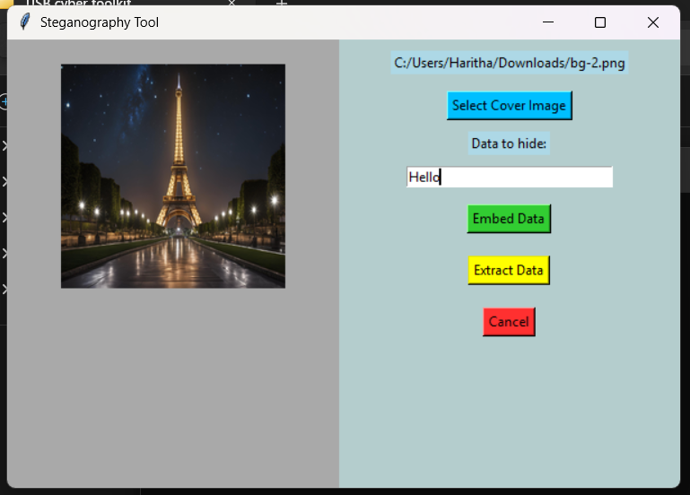
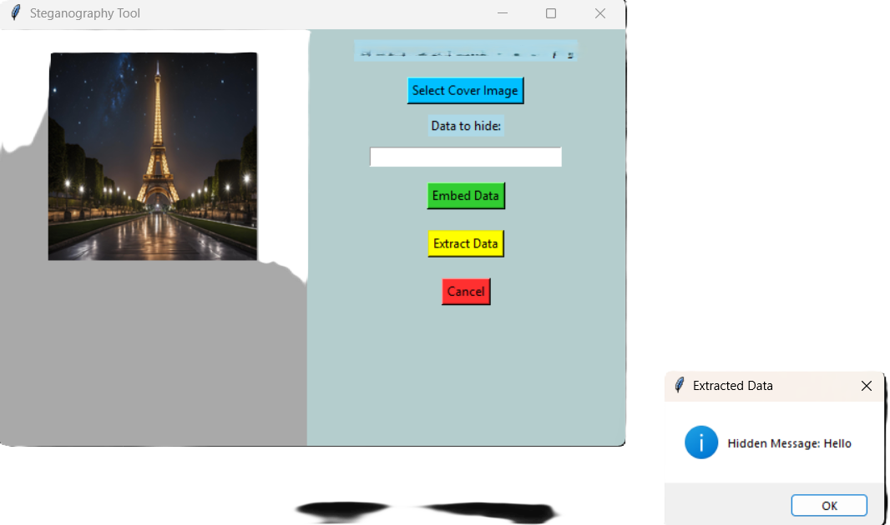

# 🖼️ StegoScope — A GUI-Based Image Steganography Tool (Tkinter + LSB)

**StegoScope** is a lightweight, beginner-friendly steganography tool built using **Python**, **Tkinter**, and the **Stegano** library. It allows you to embed secret messages into images and extract them later using a simple graphical interface. Perfect for anyone exploring steganography concepts or building a cool cybersecurity utility.

---

## 🚀 Features

- 📁 Select and display cover images (PNG/JPG/BMP)
- 🔏 Hide secret messages inside images using **LSB (Least Significant Bit)** technique
- 🧪 Extract hidden messages from stego images
- 🖱️ Intuitive graphical interface (no command-line needed)
- 🧼 Cancel/reset image selection
- 🎨 Colorful, themed GUI using Tkinter

---

## 📸 Preview

> Example:  
>  
> 

---

## 🛠️ Requirements

- Python 3.x
- [Pillow](https://pypi.org/project/Pillow/) – for image handling
- [Stegano](https://pypi.org/project/stegano/) – for LSB steganography

Install required packages with:

```bash
pip install Pillow stegano
